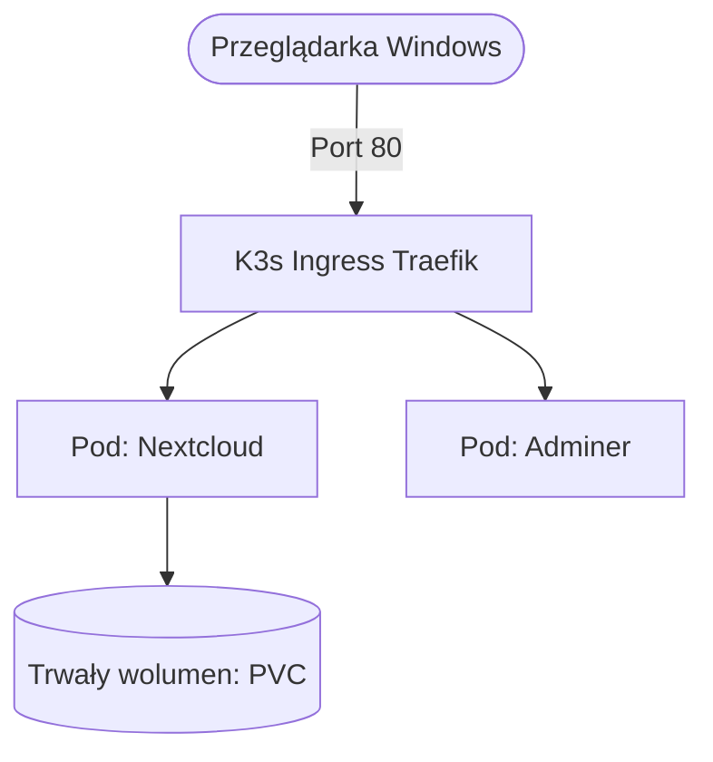

# 🚀 Instrukcja Wdrożenia Produkcyjnego Kubernetes (K3s) On-Premises

Niniejszy przewodnik opisuje krok po kroku proces produkcyjnej instalacji i konfiguracji lekkiego klastra Kubernetes (K3s) na dedykowanym serwerze Ubuntu dla klienta.

---

## 📌 Schemat Architektury Docelowej



---
## 📋 Status Środowiska Wyjściowego
*   **Maszyna Wirtualna:** Ubuntu Server (VirtualBox) w sieci mostkowanej (Bridged).
*   **Aktualny adres IP serwera:** `192.168.55.107`
*   **Dostęp:** Logowanie przez jawny adres: `ssh mariusz@192.168.55.107`
*   **Kod:** 8 plików YAML gotowych w repozytorium GitHub (`mariuszhoxton/1-kubernetes-lab`).

---

## 🛠️ Krok po Kroku: Plan Działania

### [x] Krok 1: Połączenie z serwerem i czyszczenie
- [x] Otwórz terminal na Windowsie (PowerShell/CMD).
- [x] Zaloguj się na serwer komendą: `ssh mariusz@192.168.55.107`

### [x] Krok 2: Instalacja produkcyjna K3s
- [x] Uruchom oficjalny skrypt instalacyjny K3s:
  ```bash
  curl -sfL https://k3s.io | sh -
  ```
- [x] Nadaj uprawnienia do zarządzania klastrem bez `sudo`:
  ```bash
  mkdir -p ~/.kube
  sudo cp /etc/rancher/k3s/k3s.yaml ~/.kube/config
  sudo chown \(USER:\)USER ~/.kube/config
  ```
- [x] Dopisz zmienną środowiskową na stałe do profilu użytkownika:
  ```bash
  echo "export KUBECONFIG=~/.kube/config" >> ~/.bashrc
  export KUBECONFIG=~/.kube/config
  ```
- [x] Zweryfikuj instalację (Węzeł powinien mieć status Ready i rolę control-plane):
  ```bash
  kubectl get nodes
  ```

### [ ] Krok 3: Pobranie konfiguracji z GitHub
- [ ] Zainstaluj narzędzie Git na serwerze (jeśli brakuje):
  ```bash
  sudo apt install git -y
  ```
- [ ] Sklonuj swoje repozytorium z plikami YAML:
  ```bash
  git clone https://github.com/mariuszhoxton/1-kubernetes-lab.git
  ```
- [ ] Wejdź do katalogu z projektami:
  ```bash
  cd 1-kubernetes-lab
  ```

### [ ] Krok 4: Adaptacja plików pod środowisko klienta (Port 80)
- [ ] Otwórz plik konfiguracyjny Ingressa (np. `nextcloud-ingress.yaml`) za pomocą edytora `nano`.
- [ ] **Modyfikacja:** Usuń mapowania specyficzne dla k3d/WSL (port `8081`). Ustaw ruch na standardowy port **80**, aby klient nie musiał wpisywać portu w przeglądarce.
- [ ] Zapisz i zamknij plik (`CTRL+O`, `Enter`, `CTRL+X`).

### [ ] Krok 5: Uruchomienie systemu (The Big Bang)
- [ ] Wdróż wszystkie 8 plików konfiguracyjnych YAML jednocześnie:
  ```bash
  kubectl apply -f .
  ```
- [ ] Monitoruj proces uruchamiania Podów, baz danych i wolumenów PVC:
  ```bash
  kubectl get pods -w
  ```
- *(Czekamy, aż wszystkie Pody zmienią status na `Running`)*.

### [ ] Krok 6: Konfiguracja DNS na Windows i wielki test
- [ ] Otwórz Notatnik na Windowsie jako Administrator.
- [ ] Edytuj plik hostów: `C:\Windows\System32\drivers\etc\hosts`.
- [ ] Dopisz nowe mapowanie IP klienta do domen:
  ```text
  192.168.55.210 chmura.local
  192.168.55.210 adminer.local
  ```
- [ ] Otwórz przeglądarkę na Windowsie i wpisz: `http://chmura.local`.
- [ ] **Sukces:** System działa na porcie 80 w sieci lokalnej klienta!

---

## 🛑 Procedury Awaryjne (Gdyby coś poszło nie tak)
*   **Podgląd logów danego Poda:** `kubectl logi [nazwa_poda]`
*   **Sprawdzenie błędów wdrożenia:** `kubectl describe pod [nazwa_poda]`
*   **Restart całego klastra K3s:** `sudo systemctl restart k3s`
